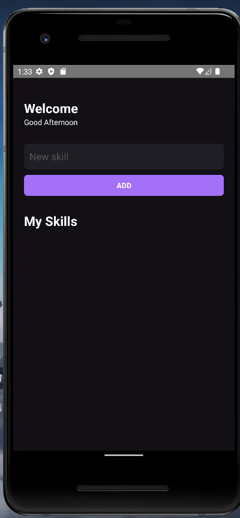
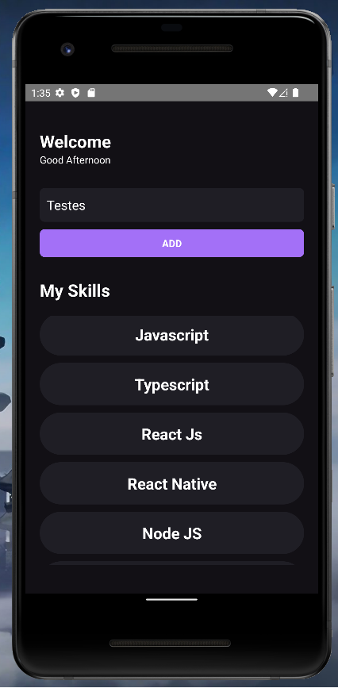

# MySkills 💜 | MySkills feito React-Native CLI

&nbsp;
<div align="center">


</div>

<br/>
<br/>

## 📚 Informações sobre o projeto

- Esse projeto foi desenvolvido durante um dos capitulos do Ignite da Rocketseat! A ideia era desenvolver um App com a CLI do react native, com base em iniciar os estudo em React native.

&nbsp;
<br/>
<br/>
## 🛠️ Tecnologias/Ferramentas ultilizadas

- [React](https://pt-br.reactjs.org/E)
- [React Native](https://reactnative.dev/)
- [Typescript](https://reactnative.dev/blog/2018/05/07/using-typescript-with-react-native)


## ⚙️ Instalação

```
# Abra um terminal e copie este repositório com o comando
$ git clone https://github.com/Hugovarellaa/dashgo
```

```
# Acesse a pasta da aplicação
$ cd dashgo

# Instale as dependências
$ yarn

# Inicie a aplicação
$ yarn dev

```

---

<p align="center">Feito com 💙 por  Hugo Alves Varella</p>
